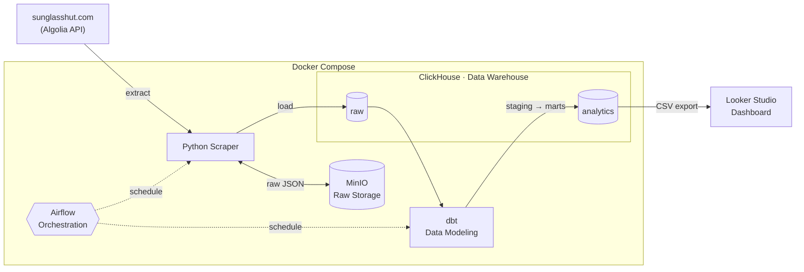
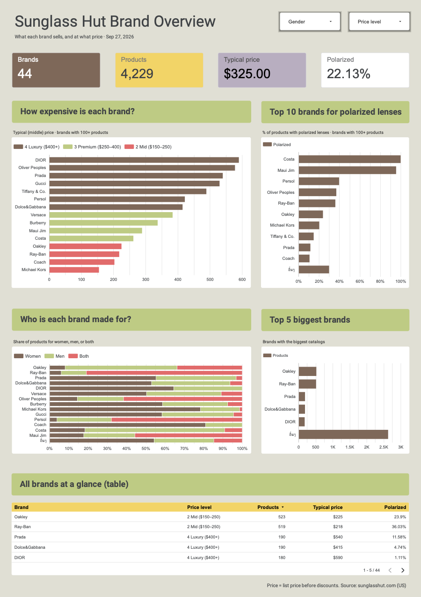

# 🕶️ Sunglass Hut ETL Data Stack


โปรเจกต์นี้เป็นระบบ Data Pipeline สำหรับวิเคราะห์ Market Positioning ของแบรนด์แว่นกันแดดบน
[sunglasshut.com](https://www.sunglasshut.com/us) (US) เช่น ระดับราคา สัดส่วนเลนส์ polarized และกลุ่มเป้าหมาย (women / men / unisex)
โดยประยุกต์ใช้ Modern Data Stack อย่าง Airflow, MinIO, ClickHouse และ dbt ในการทำ Orchestration, Raw Data Storage, Data Warehouse และ Data Modeling

เนื่องจากหน้าเว็บแสดงเฉพาะข้อมูลของวันปัจจุบัน pipeline จึงเก็บ snapshot ของ catalog ทั้งหมดไว้ทุกวัน
เพื่อรองรับทั้งการวิเคราะห์ภาพรวมตลาดและ price history

> **Airflow** (daily 09:00) → Extract จาก Algolia API → **MinIO** (raw) → **ClickHouse** → **dbt** (staging → marts) → **Looker Studio**

## 📑 Table of Contents

- [Architecture](#-architecture)
  - [dbt Models](#-dbt-models)
  - [Airflow DAG](#-airflow-dag)
- [Project Structure](#-project-structure)
- [Setup](#-setup)
- [Business Scenario](#-business-scenario)
- [Dashboard](#-dashboard)
- [Q&A](#-qa)

## 🧩 Architecture



| Component          | หน้าที่                                                                                                          |
| ------------------ | ---------------------------------------------------------------------------------------------------------------- |
| **Python Scraper** | ดึงข้อมูลสินค้าจาก Algolia API เก็บ JSON ดิบลง MinIO แล้วอ่านกลับมาแปลงเป็นตารางโหลดเข้า ClickHouse (idempotent) |
| **MinIO**          | Raw Storage เก็บ JSON ดิบทุกรอบ ทำให้ reprocess ข้อมูลย้อนหลังได้โดยไม่ต้อง scrape ใหม่                          |
| **ClickHouse**     | Data Warehouse แบ่งเป็น schema `raw` (ข้อมูลจาก scraper) และ `analytics` (ผลจาก dbt)                             |
| **dbt**            | Data Modeling จาก staging → dimension / fact / mart พร้อม data test                                              |
| **Airflow**        | Orchestration รัน scraper และ dbt ตามลำดับทุกวัน 09:00                                                           |
| **Looker Studio**  | Dashboard จาก CSV ที่ export จาก mart                                                                            |

### 🧱 dbt Models

```
raw.sunglasshut_products → stg_sunglasshut_products → dim_product / dim_brand / fct_product_snapshot → mart_product_catalog
```

| Model                      | Grain (1 แถว =)          | หน้าที่                                                      |
| -------------------------- | ------------------------ | ------------------------------------------------------------ |
| `stg_sunglasshut_products` | สินค้า × เพศ × รอบที่ดึง | เปลี่ยนชื่อคอลัมน์ และแปลง flag เป็น boolean                 |
| `dim_product`              | SKU × เพศ                | ข้อมูลล่าสุดของสินค้าแต่ละตัว                                |
| `dim_brand`                | แบรนด์                   | จำนวนสินค้า, สัดส่วนฟีเจอร์, ช่วงราคา และระดับราคา           |
| `fct_product_snapshot`     | SKU × เพศ × วัน          | ราคา สถานะลดราคา และสต็อกรายวัน                              |
| `mart_product_catalog`     | SKU (snapshot ล่าสุด)    | ตารางแบนสำหรับ BI tool มีกลุ่มเพศ `women` / `men` / `unisex` |

### 🌀 Airflow DAG

DAG `sunglasshut_daily` ([dags/sunglasshut_daily.py](dags/sunglasshut_daily.py))
รันทุกวันเวลา 09:00 (Asia/Bangkok) · `catchup=False` · `max_active_runs=1` · retry 2 ครั้ง ห่างกัน 5 นาที

```
extract >> load >> dbt_run >> dbt_test
```

| Task       | คำสั่ง                                  | หน้าที่                                                                        |
| ---------- | --------------------------------------- | ------------------------------------------------------------------------------ |
| `extract`  | `python -m scraper extract`             | ดึงข้อมูลจาก Algolia API เก็บ JSON ดิบลง MinIO แล้วส่ง run prefix ต่อผ่าน XCom |
| `load`     | `python -m scraper load --run <prefix>` | อ่าน run เดียวกันจาก MinIO แล้วโหลดเข้า `raw.sunglasshut_products`             |
| `dbt_run`  | `dbt run`                               | สร้าง staging view และตารางใน `analytics`                                      |
| `dbt_test` | `dbt test`                              | ตรวจคุณภาพข้อมูลด้วย data test                                                 |

> ถ้า `load` ล้มแล้ว retry จะอ่านข้อมูลชุดเดิมจาก MinIO ไม่ต้อง scrape ใหม่

## 📁 Project Structure

```
.
├── airflow/Dockerfile               # image ของ Airflow ที่มี venv แยกสำหรับ scraper และ dbt
├── dags/
│   └── sunglasshut_daily.py         # extract >> load >> dbt_run >> dbt_test
├── scraper/
│   ├── __main__.py                  # CLI: extract | load | run
│   ├── config.py                    # ค่าตั้งของ Algolia และช่วงราคาที่ใช้แบ่ง query
│   ├── extractors/products_api.py   # query Algolia (มี retry) และแปลงข้อมูล
│   ├── storage/raw_store.py         # ที่เก็บข้อมูลดิบใน MinIO
│   └── loaders/clickhouse_loader.py # โหลดเข้า ClickHouse แบบ idempotent
├── sunglasshut_dbt/
│   ├── models/staging/              # source และ staging view
│   ├── models/marts/                # dim_product, dim_brand, fct_product_snapshot, mart_product_catalog
│   ├── tests/                       # custom data test
│   └── profiles.yml                 # อ่านค่าการเชื่อมต่อจาก env var
├── clickhouse/init/                 # สร้าง database และตาราง raw ตอนเปิดครั้งแรก
├── data/                            # CSV ที่ export ไปใช้ทำ dashboard
├── dashboard/                       # รูปและ PDF ของ dashboard
├── docker-compose.yml               # ClickHouse, MinIO, Airflow
├── requirements.txt                 # dependency ของ scraper
└── requirements-dbt.txt             # dependency ของ dbt
```

## 🚀 Setup

**สิ่งที่ต้องมี:** Docker และ Docker Compose (พื้นที่ว่างประมาณ 4 GB สำหรับ image)

### 1️⃣ Clone & Configure `.env`

```bash
git clone https://github.com/taohooisWorking/SunglassesHubETL-pipeline.git
cd SunglassesHubETL-pipeline
cp .env.example .env
```

แก้รหัสผ่านใน `.env` ได้ตามต้องการ ส่วนค่าอื่น (host, port, ชื่อ bucket, ชื่อ database) มีค่าเริ่มต้นให้แล้ว

| ตัวแปร                                    | ใช้ทำอะไร                                            |
| ----------------------------------------- | ---------------------------------------------------- |
| `CLICKHOUSE_USER` / `CLICKHOUSE_PASSWORD` | user ของ ClickHouse ที่ scraper และ dbt ใช้เชื่อมต่อ |
| `MINIO_ROOT_USER` / `MINIO_ROOT_PASSWORD` | user ของ MinIO (password ต้องยาว 8 ตัวอักษรขึ้นไป)   |

> ไม่ต้องสร้าง Connection ใน Airflow เพราะ scraper และ dbt อ่านค่าการเชื่อมต่อจาก `.env` โดยตรง

### 2️⃣ Start Services

```bash
docker compose up -d --build
```

ครั้งแรกจะใช้เวลาสักพักเพราะต้อง build image ของ Airflow (ติดตั้ง scraper และ dbt แยกกันคนละ venv)
จากนั้นเช็กว่าทุก service ขึ้นแล้ว

```bash
docker compose ps   # sgh_clickhouse, sgh_minio, sgh_airflow ต้องเป็น Up
```

| Service       | URL                   | Login                                     |
| ------------- | --------------------- | ----------------------------------------- |
| Airflow       | http://localhost:8080 | ไม่ต้อง login (local dev)                 |
| MinIO console | http://localhost:9003 | `MINIO_ROOT_USER` / `MINIO_ROOT_PASSWORD` |
| ClickHouse    | http://localhost:8123 | `CLICKHOUSE_USER` / `CLICKHOUSE_PASSWORD` |

ตาราง `raw.sunglasshut_products` ถูกสร้างอัตโนมัติจาก `clickhouse/init/` ตอนเปิด ClickHouse ครั้งแรก

### 3️⃣ Run the Pipeline

1. เปิด Airflow → เมนู **Dags** → `sunglasshut_daily`
2. กดสวิตช์หน้าชื่อ DAG เพื่อ unpause
3. กด **Trigger** แล้วรอจนทั้ง 4 task เป็นสีเขียว (ประมาณ 5–10 นาที)
4. ดู log ของแต่ละ task ได้โดยคลิกช่องของ task ใน Grid → แท็บ **Logs**

หลังจากนั้น DAG จะรันเองทุกวันเวลา 09:00 ตราบใดที่ container ยังเปิดอยู่

### 4️⃣ Verify Results

- **MinIO:** เปิด http://localhost:9003 → bucket `sunglasshut-raw` ต้องมีโฟลเดอร์ `products/dt=<วันนี้>/`
- **ClickHouse:** นับจำนวนสินค้าในแต่ละวัน

```bash
docker compose exec clickhouse bash -c 'clickhouse-client --user "$CLICKHOUSE_USER" --password "$CLICKHOUSE_PASSWORD" \
  -q "SELECT scraped_date, count() FROM analytics.fct_product_snapshot GROUP BY scraped_date ORDER BY scraped_date DESC"'
```

### 🛑 Shut Down

```bash
docker compose down      # ปิด container แต่ข้อมูลใน ClickHouse / MinIO ยังอยู่
docker compose down -v   # ปิดและลบข้อมูลใน ClickHouse / MinIO ทั้งหมด
```

> Airflow รันแบบ `standalone` (metadata อยู่ใน SQLite ใน container) หลัง `down` ประวัติการรันจะหาย
> และ DAG จะกลับเป็น paused ต้องกด unpause ใหม่

## 🎯 Business Scenario

**Scenario: Market Positioning** — แต่ละแบรนด์อยู่ตรงไหนในตลาด

- แต่ละแบรนด์ขายราคาระดับไหน
- แบรนด์ไหนมีเลนส์ polarized มากที่สุด
- แบรนด์ไหนมีสินค้ามากที่สุด
- แต่ละแบรนด์ทำสินค้าให้ผู้หญิง ผู้ชาย หรือ unisex

## 📊 Dashboard

[](https://datastudio.google.com/reporting/6fb4fb5f-2f6e-482d-84ca-13108a3771be)

[Looker Studio](https://datastudio.google.com/reporting/6fb4fb5f-2f6e-482d-84ca-13108a3771be) · [PDF](dashboard/dashboard.pdf)

## 💬 Q&A

### 1. What did you learn from this project?

เพิ่งเคยได้ลองทำโปรเจค data stack แบบจัดเต็ม ที่รวมหลายๆเครื่องมือที่ได้เรียนมาตลอดค่ะ 🥹 ซึ่งปกติตอนที่เรียน เราจะเรียนแยกแต่ละเครื่องมือในแต่ละคลาส ซึ่งพี่ๆเค้าก็จะ set env เตรียมโปรเจคสะอาด ๆ ให้เรา clone มาทำตาม หนูก็จะมองเป็นภาพจำแยกเป็นแต่ละ stack ว่าทำอะไร ใช้งานยังไง แต่ก็ยังมองไม่ค่อยออกว่าต้องเอาไปใช้งานกับตัวอื่น ๆ ยังไงต่อ พอได้มาลองทำแบบโปรเจคแล้วเราต้องเริ่มเองตั้งแต่ setup project, setup แต่ละเครื่องมือ เอามาใช้ด้วยกัน ลองวาง structure เอง ทำให้เริ่มมองออกเห็นภาพขึ้นว่าแต่ละ stack มองเห็นกันสอดคล้องกันยังไง ซึ่งระหว่างทางก็จะเจอปัญหาเรื่อยๆ เช่น scrape ข้อมูลไม่ได้, container มองไม่เห็นกัน, เขียน dags ไม่ถูก dags พัง เป็นต้น พอเจอปัญหาทำให้ได้ฝึก debug ไปเรื่อยๆทีละสเต็ป (หรือโละบางสเต็ปทิ้งทำใหม่ TvT)

ในพาร์ทที่หนูคิดว่าเข้าใจและชอบสุดน่าจะเป็นช่วง ต่อ clickhouse กับ dbt ที่ได้ทำ stg และ mart ได้เรียนรู้การเขียน SQL ทำ CTE มากขึ้น ลองวิเคราะห์จากข้อมูลที่ได้จากการ staging และคิด scenario เพื่อ mart data มาใช้ และขั้นตอนสุดท้ายที่ชอบคือการเอาข้อมูลที่ได้มาสรุปทำ dashboard ใน data studio สนุกตอนทำ UI ค่ะ

### 2. How would you improve it?

ปัญหาที่ติดบ่อย ๆ จะเป็นช่วงที่ scrape ข้อมูลจากเว็บค่ะ เนื่องจากหน้าเว็บโหลดสินค้าผ่าน JavaScript ที่ไปเรียก Algolia อีกที พอใช้วิธี HTML scraping แล้วได้ข้อมูลไม่ครบ เลยเปลี่ยนมาเรียก Algolia Search API ตรง ๆ แทน ซึ่งทำให้ได้ข้อมูลครบและละเอียดกว่าเดิมเยอะ ซึ่งช่วงแรกหนูก็ยังไม่ค่อยเข้าใจวิธีการเขียน scraper มากเท่าไหร่ ไม่รู้ว่าต้องทำประมาณไหนแล้ววิธีไหนดีที่สุด ทำให้มากระทบอีกทีตอนทำโหลดข้อมูลเข้า clickhouse และทำให้ตอน extract ตอนที่ทำ dags พังไปด้วย ถ้าเข้าใจตรงนี้มากขึ้นอาจจะลดปัญหาและเวลาที่ติดไปได้

### 3. If you had to do it all over again, what would you do differently?

- อยากลองวางแผนก่อนเริ่มโปรเจคให้มากขึ้น เพราะพอมองออกแล้วว่าควรเริ่มยังไง แต่ละขั้นตอนต้องทำอะไรบ้าง
- ลองคิด scenario ใหม่ ๆ จะได้ลอง mart ข้อมูลหลายๆแบบ
- เนื่องจากราคาของแว่นมีการเปลี่ยนแปลงเรื่อยๆ อยากลอง scenario ที่ต้องเก็บข้อมูลหลาย ๆ วันมาวิเคราะห์
- ลองวิธีที่ต่อ dashboard กับ database ได้ตรง ๆ ไม่ต้อง import CSV ใส่เอง
